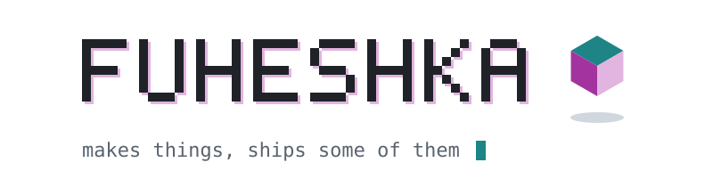
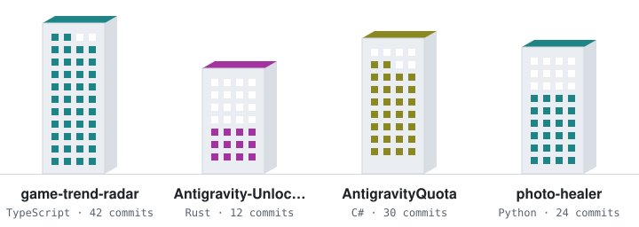
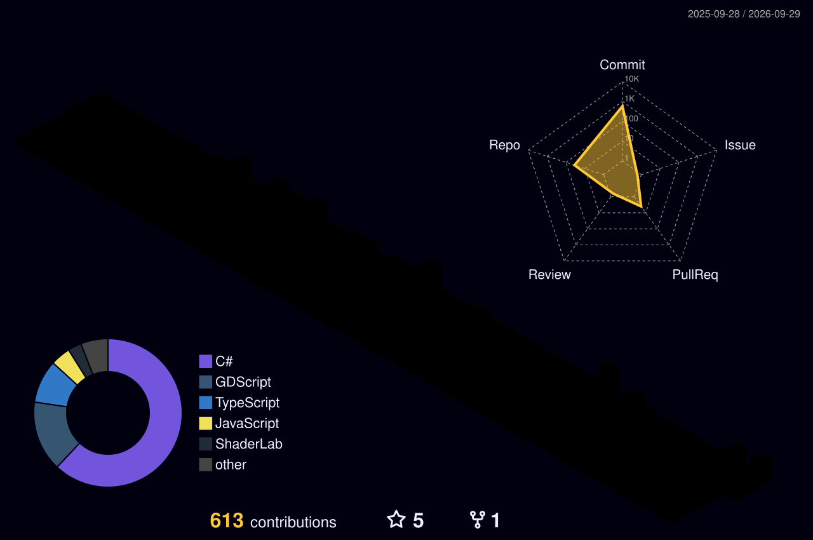

<picture>
  <source media="(prefers-color-scheme: dark)" srcset="assets/hero-dark.svg">
  
</picture>

  

I make games in Unity and Godot, show up at game jams, and write small tools whenever something on my Mac gets in the way. 
Some of it ships, some of it doesn't, and most of it is written with AI help, which I'm not hiding.

<a href="https://fuheshka.itch.io/">itch.io</a> &nbsp;·&nbsp;
<a href="https://fuheshka.is-a.dev/">portfolio</a> &nbsp;·&nbsp;
<a href="https://t.me/fuheshka">telegram</a> &nbsp;·&nbsp;
<a href="mailto:fuheshka@gmail.com">email</a>

  

<picture>
  <source media="(prefers-color-scheme: dark)" srcset="assets/stack-dark.svg">
  
</picture>

   

<!-- lights:start -->
<picture>
  <source media="(prefers-color-scheme: dark)" srcset="assets/lights-dark.svg">
  
</picture>
 
lights on right now: what I touched last, one lit window per commit in the past 30 days
 
<a href="https://github.com/Fuheshka/game-trend-radar">game-trend-radar</a> &nbsp;·&nbsp; <a href="https://github.com/Fuheshka/Antigravity-Unlocker">Antigravity-Unlocker</a> &nbsp;·&nbsp; <a href="https://github.com/Fuheshka/AntigravityQuota">AntigravityQuota</a> &nbsp;·&nbsp; <a href="https://github.com/Fuheshka/photo-healer">photo-healer</a>
<!-- lights:end -->

<!-- project history, hidden for now

<b>Jam archive</b> and other small things

 

- [BIOMASS](https://fuheshka.itch.io/biomass) — MyIndie January Rush lvl 8 · `Unity` `Jam`
- [Cursed by The Sword](https://fuheshka.itch.io/cursed-by-the-sword) — MyIndie January Rush lvl 7 · `Unity` `Jam`
- [Quiet Escape](https://github.com/Fuheshka/Quiet-Escape) — stealth puzzle, hide from enemies using the environment · `Unity`
- [No Escape From Wonderland](https://github.com/Fuheshka/No-Escape-From-Wonderland) — dark Alice in a Vampire Survivors mould · `Unity`
- Bad Bunny Day — action arcade: character controller, eating system, enemy AI · `Unity` `Jam`
- [Chamber Loop](https://github.com/Fuheshka/ChamberLoop) — roguelite made for a university course · `Unity`
- [CODEBREAKER: Infection Protocol](https://github.com/AndreyKhara/CODEBREAKER-Infection-Protocol) — pixel shooter with modular weapons · `Unity` `Team`
- [Edges Of Reality](https://github.com/MSchulcz/EdgesOfReality) — metroidvania across two worlds · `Unity` `Team`
- [Pizza Hunt](https://github.com/Fuheshka/PizzaRunnerO) — PS1-style endless runner, procedural paths · `Unity` `Jam`
- [Bunny Jump](https://github.com/Fuheshka/BunnyJump) — first try at a web engine · `Phaser 3` `JavaScript`

Tools: [AntigravityQuota](https://github.com/Fuheshka/AntigravityQuota) (macOS menu bar quota monitor) ·
[YamKeys](https://github.com/Fuheshka/YamKeys) (media keys for Yandex Music) ·
[photo-healer](https://github.com/Fuheshka/photo-healer) (rescues TRIM-damaged photos) ·
[web-media-converter](https://fuheshka.github.io/web-media-converter/) (FFmpeg in the browser)

-->

  

  
   
  this city is built from commits. it's the longest-running game here.

